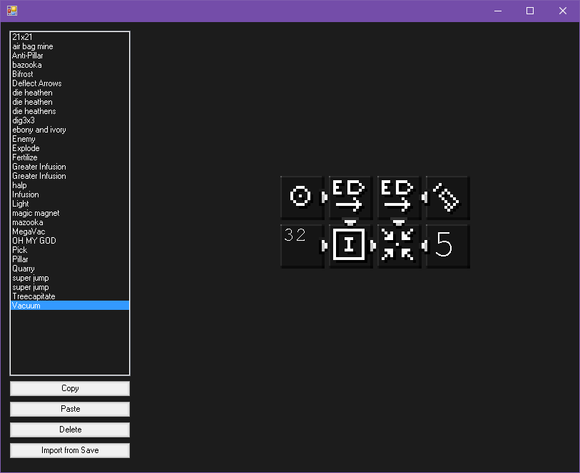

#Psi Spell Library

A rather basic program for managing [Psi](http://psi.vazkii.us) spells, written for [/r/psispellcompendium](https://reddit.com/r/psispellcompendium).

Written in C#, using [fNbt](https://github.com/fragmer/fnbt) for internal stuff and [#ZipLib](https://github.com/icsharpcode/sharpziplib) to retrieve textures from the Psi jar.

Spells are stored in your "My Documents" (or equivalent), in "Psi Spell Library"

#IMPORTANT
To get spell previews, you need to [download](http://psi.vazkii.us/downloads.php) the latest version of Psi and put it in the same folder as SpellLibrary.exe.
The program will also yell at you about this.

Once I get reliable Internet, I will add support for loading spells from and posting to /r/psispellcompendium.
This may take a while.

I know it sucks, if anyone can tell me any of the many things I'm doing wrong, please do.

